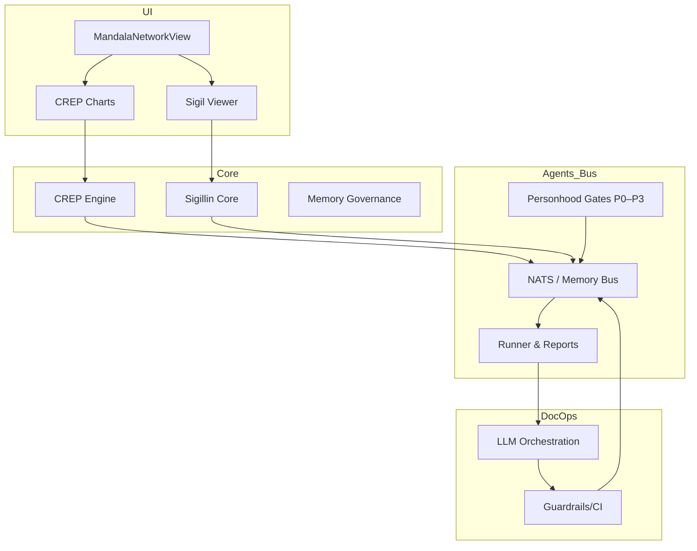

# Architekturüberblick

- **UI/UX**: MandalaNetworkView, Sigil Viewer, CREP Charts  
- **Core**: CREP Engine, Sigillin Core, Memory Governance  
- **Agents/Bus**: NATS/Memory Bus, Runner/Reports, Personhood Gates  
- **DocOps**: LLM-Orchestrierung, Guardrails/CI

