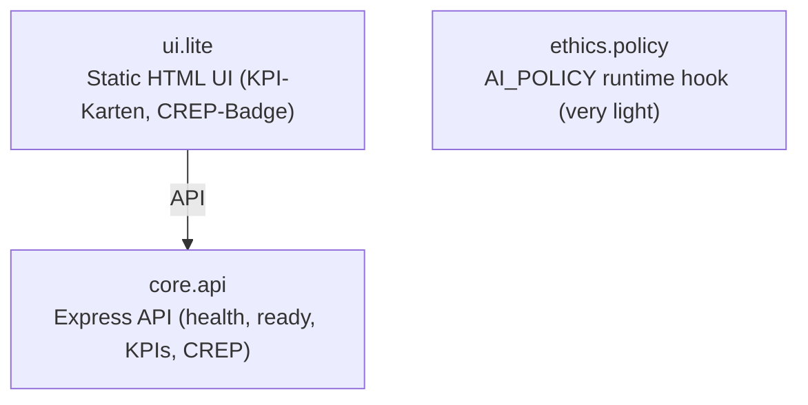
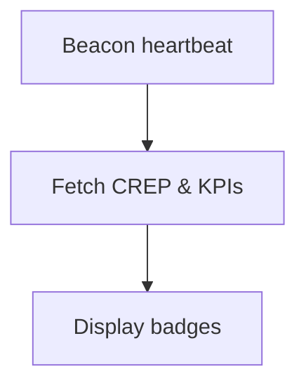

# Maps

## Repo

```mermaid
graph TD;
  core_api["core.api\nExpress API (health, ready, KPIs, CREP)"]
  ui_lite["ui.lite\nStatic HTML UI (KPI-Karten, CREP-Badge)"]
  ethics_policy["ethics.policy\nAI_POLICY runtime hook (very light)"]
  ui_lite -->|API| core_api

```

## Flow

```mermaid
flowchart TD;
  S0["Beacon heartbeat"]
  S1["Fetch CREP & KPIs"]
  S2["Display badges"]
  S0 --> S1
  S1 --> S2


```